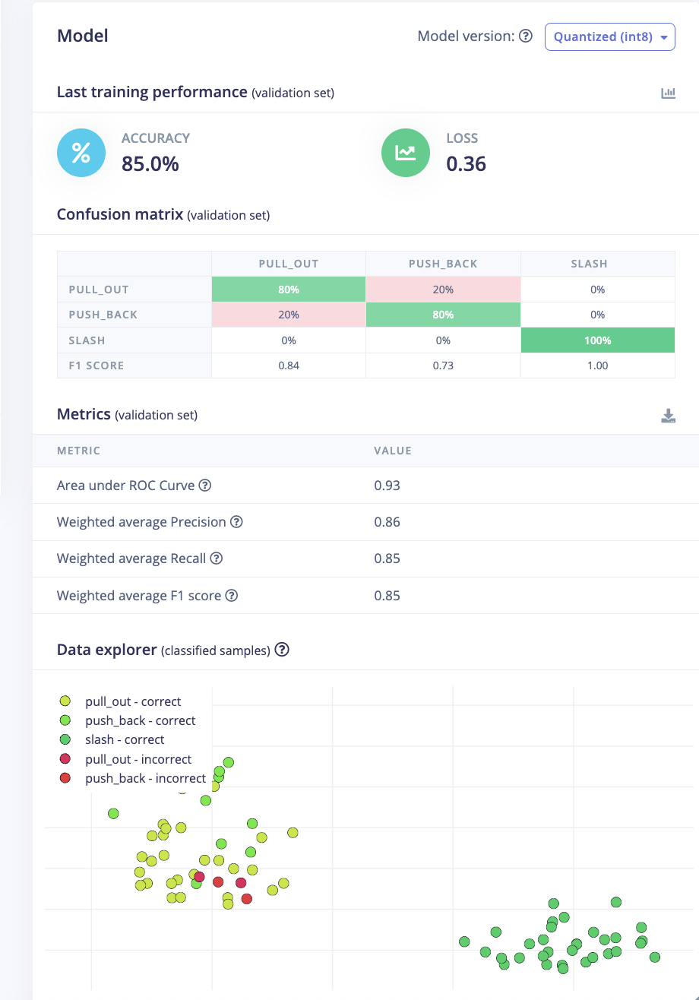

# TECHIN515 Lab 4 — Magic Wand Report

## Hardware Setup

**截图提醒：** 拍一张实物照片 — 两个LSM6DS3传感器、NeoPixel灯条、按钮、XIAO ESP32C3全部接好的样子。

<!--  -->

**Connections:**
- Handle sensor (LSM6DS3): SA0 → GND → I2C 0x6A
- Sheath sensor (LSM6DS3): SA0 → 3.3V → I2C 0x6B
- NeoPixel strip (8 LEDs): D0
- Button: D1 (INPUT_PULLUP, active LOW)
- SDA: D4 / SCL: D5

---

## Part 1: Data Collection

### Gesture Definitions

| Gesture | Chinese | Motion Description |
|---------|---------|-------------------|
| `pull_out` | 拔剑 | Two sensors move apart — handle pulled from sheath |
| `push_back` | 合剑 | Two sensors move together — blade returned to sheath |
| `slash` | 挥动 | Both sensors swing together in arc |

### Dataset Overview

**截图提醒 ①：** Edge Impulse → Data acquisition 页面，展示所有样本列表（showing Training/Test split, 3 labels, sample count）。

<!--  -->

- Total samples: 120 (96 training / 24 test, 80/20 split)
- Capture: 1 second @ 100 Hz = 100 samples per capture
- Axes captured: ax1, ay1, az1 (handle) + ax2, ay2, az2 (sheath)
- Collectors: Felix + Student B (20 samples each per gesture)

**截图提醒 ②：** 点开一个 `pull_out` 样本，展示6轴波形图。再各点一个 `push_back` 和 `slash`，分别截图。

<!--  -->
<!--  -->
<!--  -->

The three gestures produce visually distinct raw waveform signatures:

- **`pull_out` (拔剑):** Both sensor groups show sustained oscillation beginning around 300ms and lasting through the capture window. The handle (ax1/ay1/az1) and sheath (ax2/ay2/az2) axes diverge progressively as the blade separates from the sheath, with amplitude around ±10 m/s².

- **`push_back` (合剑):** The signal is almost entirely flat except for a single sharp impulse around 360–480ms — the moment of contact as the blade is seated back into the sheath. Peak amplitude reaches −60 m/s² on the az axes, making this the most compact and high-amplitude single event of the three gestures.

- **`slash` (挥动):** A large compound waveform occupies the 360–720ms range, with both sensor groups swinging together. The red (ax1) and green (ax2) axes dominate, reflecting the primary swing plane. The signal then decays back toward zero as the wrist decelerates.

These distinct temporal profiles — sustained divergence, single impulse, and synchronized swing — make the gesture classes well-separated in both time and frequency domains.

**Discussion:** Using data collected by multiple people improves model robustness — individual variation in gesture speed, wrist angle, and force is a key source of real-world test failures. Training on a single person's data overfits to that person's style and performs poorly for others.

---

## Part 2: Edge Impulse Model

### Impulse Design

**截图提醒 ③：** Edge Impulse → Impulse Design 页面，显示完整流水线（Time Series Input → Spectral Analysis → Classification → Output）。

<!--  -->

**Configuration:**
- Window size: 1000 ms
- Window stride: 100 ms
- Frequency: 100 Hz
- Input axes: 6 (ax1, ay1, az1, ax2, ay2, az2)
- Processing block: **Spectral Analysis** — extracts frequency-domain features (power spectral density, peak frequency) from each axis, effective for motion gestures with distinct frequency signatures
- Learning block: **Neural Network (Keras)** — suitable for classifying fixed-length feature vectors

**Justification for Spectral Analysis:** The three gestures differ not only in magnitude but in frequency content. `slash` has high-frequency oscillation; `pull_out`/`push_back` have slower low-frequency profiles. Spectral features expose this separation more cleanly than raw time-domain features.

### DSP Features

**截图提醒 ④：** Spectral Features → Generate features → 截图 **Feature Explorer** 散点图（3种颜色代表3个类别）。

<!--  -->

The Feature Explorer (2D PCA projection of spectral features) shows clear spatial separation between the three gesture classes:

- **`slash` (green):** Tightly clustered in the upper-left region. The high-frequency synchronized swing produces a consistent spectral signature with low intra-class variance — the model's easiest class to distinguish.
- **`push_back` (orange):** Clustered in the upper-right, well-separated from slash. The single high-amplitude impulse at contact creates a distinctive high-energy, short-duration spectral peak that maps to a compact feature region.
- **`pull_out` (blue):** Occupies the lower-center region. Slightly more spread than the other two classes due to natural variation in how fast different people draw the blade, but still clearly distinct from slash. Some minor overlap with push_back at the cluster boundaries is visible and expected.

Overall, the three clusters are well-separated with no major overlap, indicating that Spectral Analysis extracts features sufficient for reliable classification. The decision boundaries are approximately: slash (upper-left) / push_back (upper-right) / pull_out (lower-center), with the primary discriminating axes corresponding to frequency energy distribution across the two sensor groups.

96 training windows generated (32 per class, perfectly balanced).

### Neural Network Architecture & Training

**截图提醒 ⑤：** Classifier 页面，截图 **training accuracy / loss curve**（左侧的图表）。

<!--  -->

**截图提醒 ⑥：** 截图 **Confusion Matrix**（training set）。

<!--  -->

**Hyperparameters:**

| Parameter | Value |
|-----------|-------|
| Training cycles | 100 |
| Learning rate | 0.0005 |
| Architecture | Dense(20) → Dense(10) → Softmax(3) |
| Minimum confidence | 0.7 |

**Training results (validation set):**

| Metric | Value |
|--------|-------|
| Accuracy | **85.0%** |
| Loss | 0.36 |
| AUC (ROC) | 0.93 |
| Weighted avg Precision | 0.86 |
| Weighted avg Recall | 0.85 |
| Weighted avg F1 | 0.85 |

**Confusion matrix (validation set):**

| | Predicted pull_out | Predicted push_back | Predicted slash |
|---|---|---|---|
| **pull_out** | **80%** | 20% | 0% |
| **push_back** | 20% | **80%** | 0% |
| **slash** | 0% | 0% | **100%** |
| F1 | 0.84 | 0.73 | 1.00 |

`slash` achieves perfect classification (F1 = 1.00). The primary error is mutual confusion between `pull_out` and `push_back` (20% each), which is expected: both gestures involve relative motion between the two sensors along the same axis, differing only in direction. Spectral Analysis captures frequency content but not directionality — a known limitation of this approach for opposing-direction gestures.

### Model Testing

**截图提醒 ⑦：** Model Testing 页面，截图测试集的 **accuracy + confusion matrix**。

<!--  -->

**Test set results (24 samples, unoptimized float32):**

| Metric | Value |
|--------|-------|
| Test accuracy | **79.17%** |
| AUC (ROC) | 0.98 |
| Weighted avg Precision | 0.96 |
| Weighted avg Recall | 0.96 |
| Weighted avg F1 | 0.96 |

**Test confusion matrix:**

| | pull_out | push_back | slash | uncertain |
|---|---|---|---|---|
| **pull_out** | **75%** | 0% | 0% | 25% |
| **push_back** | 12.5% | **62.5%** | 0% | 25% |
| **slash** | 0% | 0% | **100%** | 0% |
| F1 | 0.80 | 0.77 | 1.00 | — |

The UNCERTAIN column represents samples that fell below the 0.7 confidence threshold and were not assigned a class. `slash` retains perfect accuracy on the test set. `pull_out` and `push_back` each have 25% uncertain predictions, and `push_back` has an additional 12.5% misclassified as `pull_out`. The high AUC (0.98) indicates the model's probability outputs are well-separated even where individual predictions fall below threshold. The gap between training accuracy (85%) and test accuracy (79%) is consistent with the small dataset size (96 training windows).

**Discussion — Two strategies to improve performance:**
1. **Increase training data diversity:** add more participants and capture gestures at varying speeds. Currently 2 people; adding 2–3 more would reduce person-specific overfitting and the pull_out/push_back confusion.
2. **Add relative motion features:** compute the difference between the two sensors' accelerations (ax1−ax2, ay1−ay2, az1−az2) as additional input axes. This explicitly encodes the direction of relative motion between handle and sheath, which is the key discriminator between pull_out and push_back.

---

## Part 3: ESP32 Deployment

### Live Classification

**截图提醒 ⑧：** Live Classification 页面，实时测试时截图，展示gesture预测结果和置信度。

<!--  -->

### Real-time Performance

Testing methodology: 10 repetitions per gesture, recorded prediction vs ground truth.

| Gesture | Correct | Uncertain | Wrong | Accuracy |
|---------|---------|-----------|-------|----------|
| pull_out | | | | |
| push_back | | | | |
| slash | | | | |

### Button-triggered Inference

The wand triggers capture on button press (D1, active LOW) rather than Serial command. A rainbow LED animation plays during the 1-second capture window. After inference:

- `pull_out` → Blue (0, 0, 220) — Expecto Patronum
- `push_back` → Green (0, 200, 0) — Episkey  
- `slash` → Red (220, 0, 0) — Sectumsempra
- Uncertain → Grey (80, 80, 80)

**截图提醒 ⑨ (可选)：** Serial Monitor 截图，展示inference输出（gesture name + confidence %）。

<!--  -->

---

## Part 4: Battery & Enclosure

**截图提醒 ⑩：** 拍实物照片 — 装进外壳后的完整wand。

<!--  -->

---

## Demo Video

[Link to demo video — show button press → rainbow capture → LED color result]

---

## Challenges & Solutions

| Challenge | Solution |
|-----------|----------|
| Auto-detect failed for XIAO port | Added "JTAG"/"usbmodem" keywords to port detection |
| Both sensors same I2C address (0x6B) | Rewrote I2C scanner; found SA0 pin wiring error; moved handle SA0 → GND |
| MPU6050 library wrong for LSM6DS3 | Switched to `Adafruit_LSM6DS3`, updated addresses 0x6A/0x6B |
| Serial Monitor blocking Python script | Close Arduino Serial Monitor before running capture script |
